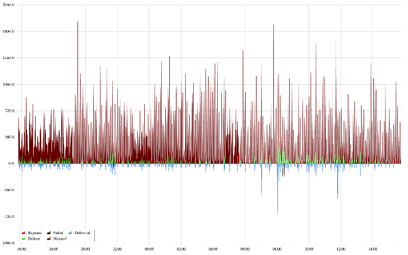

# Halon Graph

This is a small program that is meant to graph the mail statistics from a [Halon][1] mail server.

Example on how it looks:


## Setup

Rename `.env.example` to `.env` and enter your info into it.

Install all libraries

```sh
npm install
```

Build and start local webserver

```sh
npm run prod
```

or

```sh
npm start
```

You can start the server without building with if it's already done

```sh
npm server:prod
```

## Licence

[MIT][2]

[1]: https://halon.io/
[2]: https://choosealicense.com/licenses/mit/